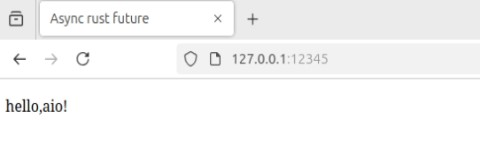
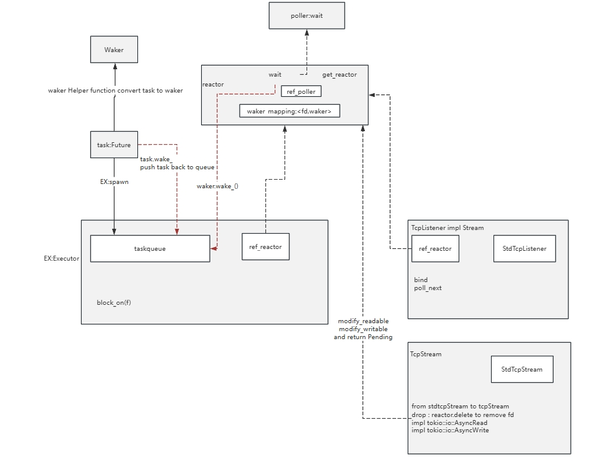
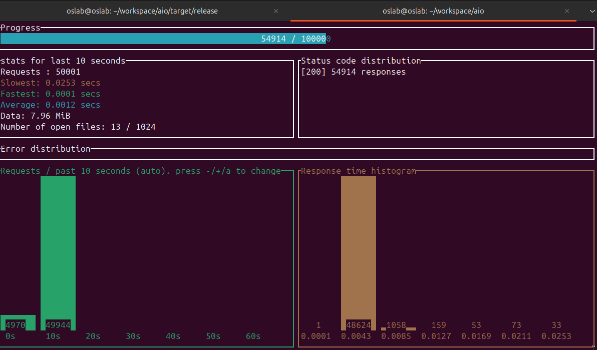

## aio
a simple io using epoll
### use case
```
run hello.rs
the server listened on 127.0.0.1:12345
on browser push a request `http://127.0.0.1:12345`
you will get the result hello.html as follows
```


### code structure


### load test
oha -n 1000000 -c 1000 -q 50000 --latency-correction --disable-keepalive http://127.0.0.1:12345



```
Summary:
  Success rate:	100.00%
  Total:	20.0123 secs
  Slowest:	0.0253 secs
  Fastest:	0.0001 secs
  Average:	0.0011 secs
  Requests/sec:	4996.9388

  Total data:	15.93 MiB
  Size/request:	167 B
  Size/sec:	814.93 KiB

Response time histogram:
  0.000 [1]     |
  0.003 [93233] |■■■■■■■■■■■■■■■■■■■■■■■■■■■■■■■■
  0.005 [5718]  |■
  0.008 [637]   |
  0.010 [149]   |
  0.013 [92]    |
  0.015 [39]    |
  0.018 [21]    |
  0.020 [61]    |
  0.023 [35]    |
  0.025 [14]    |

Response time distribution:
  10.00% in 0.0005 secs
  25.00% in 0.0006 secs
  50.00% in 0.0008 secs
  75.00% in 0.0013 secs
  90.00% in 0.0022 secs
  95.00% in 0.0030 secs
  99.00% in 0.0052 secs
  99.90% in 0.0189 secs
  99.99% in 0.0249 secs


Details (average, fastest, slowest):
  DNS+dialup:	0.0003 secs, 0.0000 secs, 0.0174 secs
  DNS-lookup:	0.0000 secs, 0.0000 secs, 0.0025 secs

Status code distribution:
  [200] 100000 responses

```